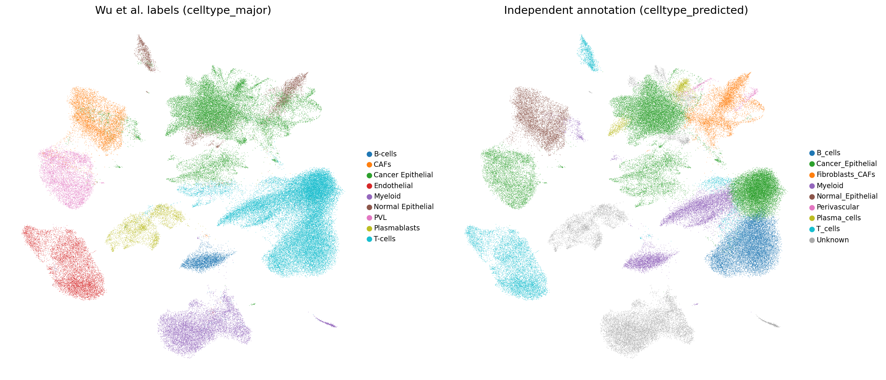
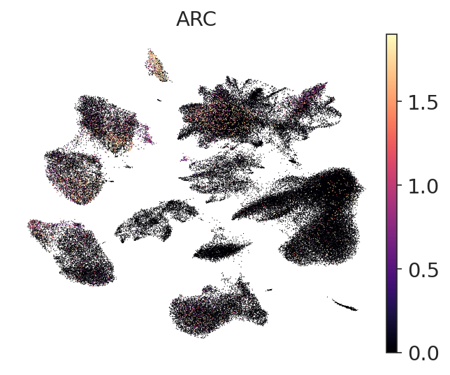
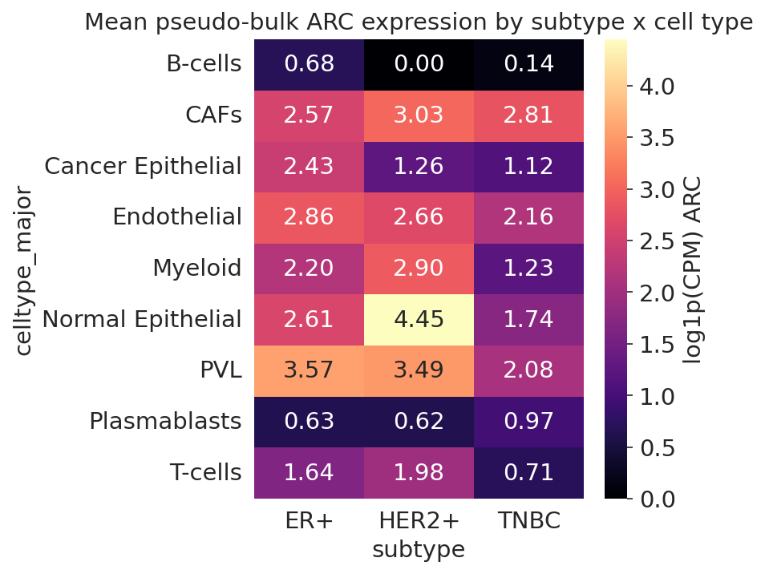
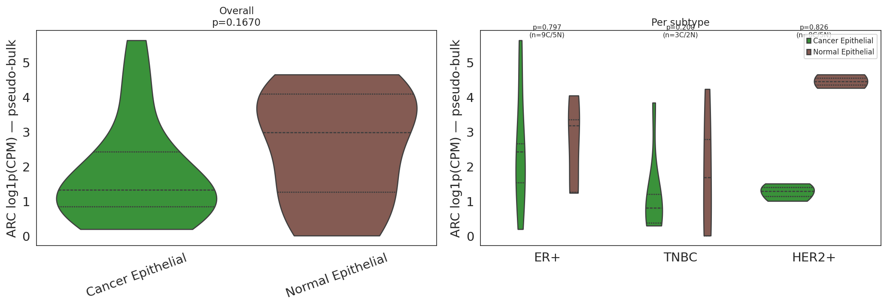

# scRNA-seq Analysis of ARC Expression Across Breast Cancer Subtypes

Single-cell RNA-seq analysis of primary breast tumors (Wu et al. 2021, GSE176078) focused on
the expression of **ARC** (Activity-Regulated Cytoskeleton-associated protein) across
molecular subtypes (ER+, HER2+, TNBC) and cell populations.

## Overview
Intratumoral heterogeneity is increasingly understood to arise from non-genetic mechanisms that shape transcriptional cell states. While much of this work has focused on intracellular regulatory programs, less is known about whether specialized mechanisms of intercellular communication contribute to how these states are maintained or interact within tumors.

This project explores the expression of ARC (Activity-Regulated Cytoskeleton-associated protein), a gene known to mediate RNA transfer via virus-like capsid formation in neuronal systems, in single-cell RNA-seq datasets from breast cancer patients. The goal is to investigate whether ARC is expressed in tumor versus non-tumor cell populations and to explore its potential as a marker of cell-state–associated communication programs in cancer.

## Biological question

Is ARC expressed in specific cell populations within tumors of patients with breast cancer, and does its expression differ between malignant and non-malignant cell states?

## Dataset

- **Source**: Wu et al. 2021, *Nature Genetics*. "A single-cell and spatially resolved atlas of
  human breast cancers."
- **GEO accession**: [GSE176078](https://www.ncbi.nlm.nih.gov/geo/query/acc.cgi?acc=GSE176078)
- **Deposited matrix**: 100,064 cells from 26 primary tumors (pre-QC filtered by Wu et al.)
- **Subtypes**: 11 ER+, 5 HER2+, 10 TNBC (clinical IHC-based)
- **Cell types**: Cancer Epithelial, Normal Epithelial, T-cells, B-cells, Plasmablasts,
  Myeloid, CAFs, Endothelial, PVL (Wu et al. CNV-based annotation, used as primary labels)

## Project structure

```
breast-cancer-arc-scrnaseq/
├── README.md
├── environment.yml              # Conda environment for reproducibility
├── .gitignore                   # Excludes data/ and large outputs
├── data/
│   ├── raw/                     # GSE176078 downloads (gitignored)
│   └── processed/               # Intermediate .h5ad files (gitignored)
├── notebooks/
│   ├── 01_data_download.ipynb
│   ├── 02_qc_filtering.ipynb
│   ├── 03_normalization_hvg.ipynb
│   ├── 04_integration_clustering.ipynb
│   ├── 05_annotation.ipynb
│   ├── 06_arc_expression.ipynb
│   └── 07_figures.ipynb
├── src/                         # Reusable Python modules
│   ├── __init__.py
│   ├── config.py                # Paths and parameters
│   ├── qc.py                    # QC utilities
│   ├── preprocessing.py         # Normalization, HVG, integration
│   ├── annotation.py            # Marker-based annotation
│   └── arc_analysis.py          # Arc-specific analysis
├── figures/
└── results/
```

## Setup

### 1. Create conda environment

```bash
conda env create -f environment.yml
conda activate arc-breast
```

### 2. Install Jupyter kernel

```bash
python -m ipykernel install --user --name arc-breast --display-name "Python (arc-breast)"
```

### 3. Register environment in VS Code

- Open VS Code → Command Palette (`Cmd+Shift+P`) → "Python: Select Interpreter" → choose `arc-breast`
- For notebooks: select the "Python (arc-breast)" kernel in the top-right of each `.ipynb`

## Execution strategy

Due to the dataset size (~130K cells, ~15-20 GB peak memory during some operations) and my
hardware constraints (8 GB Mac), the pipeline is designed in two modes:

- **`DEV_MODE = True`** (default in `src/config.py`): Subsamples to ~40K cells, runs locally
  on the Mac. Use for development and testing.
- **`DEV_MODE = False`**: Full dataset run. Execute on Google Colab (free tier, 12–16 GB RAM)
  or Kaggle Notebooks (30 GB RAM) for final results.

## Pipeline order

Run notebooks in numerical order. Each notebook reads from / writes to `data/processed/` and
can be re-run independently once its input h5ad exists.

1. `01_data_download.ipynb` — Download GSE176078 from GEO
2. `02_qc_filtering.ipynb` — Per-sample QC, doublet removal
3. `03_normalization_hvg.ipynb` — Log-normalization, HVG selection
4. `04_integration_clustering.ipynb` — Harmony batch correction, Leiden clustering, UMAP
5. `05_annotation.ipynb` — Cell type annotation (marker-based + authors' labels)
6. `06_arc_expression.ipynb` — ARC expression analysis across subtypes / cell types
7. `07_figures.ipynb` — Publication-quality figures

## Key decisions and caveats

### Data and QC
- **Deposited matrix is pre-QC filtered.** Wu et al. applied QC before deposition (EmptyDrops,
  gene >200, UMI >250, mito <20%). Our QC notebook is a second-pass sanity check that loses
  <0.3% additional cells. Scrublet doublet detection removed ~300 residual doublets (0.3%).
- **MAD-based outlier filtering was not applied** to maintain methodological fidelity to
  Wu et al.'s original pipeline. Scrublet handles doublets instead.

### Integration and clustering
- **Harmony batch correction** by patient (`orig.ident`). Wu et al. used Seurat CCA — Harmony
  is a faster CPU-compatible alternative producing qualitatively similar results.
- **PCA without scaling** (omitted for memory efficiency on 8 GB Mac). HVG filtering already
  removes most high-variance housekeeping genes; scaling marginally improves cluster separation
  but is not critical for major cell type resolution.
- **Leiden resolution 0.8** (22 clusters) used for final analysis, matching Wu et al.'s default.
- **HVG selection on merged dataset** (not per-batch) due to numerical instability of LOESS
  fitting on per-patient subsamples (~1,500 cells each). Batch effects corrected by Harmony.
- **ARC forced into HVG set** via `protected_genes` mechanism — ARC may not rank in top 2,000
  most variable genes given sparse expression (~5% of cells).

### Cell type annotation
- **Wu et al.'s `celltype_major` labels used as primary annotation.** These are based on CNV
  inference (inferCNV) which reliably distinguishes Cancer from Normal Epithelial cells — a
  distinction not achievable by transcriptional clustering alone.
- **Independent marker-based annotation** agreed with Wu's labels at 93–99% across 8 of 9
  major cell types. Exception: Endothelial cells (0% agreement) — our marker scoring assigned
  them to Myeloid based on CD68/LYZ/CSF1R expression, likely reflecting tumor-associated
  endothelial cells co-expressing myeloid markers.
- **Normal/Cancer Epithelial mixing** in Leiden cluster 5 (~73% cancer, 27% normal at
  resolution 0.8) reflects transcriptional similarity between luminal progenitor-like cells
  and luminal cancer cells. This is a known limitation of expression-based clustering for
  distinguishing malignant from normal epithelial cells.

### Statistical approach
- **Per-cell statistics** (pct_expressing, mean_expr) are reported as exploratory.
- **Pseudo-bulk analysis** (per patient × cell type) is the primary statistical method.
  Per-cell tests violate independence assumptions; see Squair et al. 2021, *Nature
  Communications* for justification of pseudo-bulk approach.
- **Low statistical power**: 3–11 patients per subtype per cell type. No pairwise subtype
  comparison survived FDR correction (all FDR >0.25). Results are **exploratory**.

### ARC biology
- **ARC is a neuronal immediate-early gene** (synaptic plasticity, long-term memory). Its role
  in breast cancer is not well-established. Expression in breast tumor cells is sparse
  (~5% of cells dataset-wide).
- **Related published work**: Yee et al. 2025 (*World J Oncol*, PMC11750752) studied ARC in
  breast cancer using bulk RNA (TCGA n=1,069, SCAN-B n=3,273) and found significantly higher
  ARC in ER+/HER2- vs other subtypes. They also analyzed GSE176078 (this dataset) at
  single-cell level and found ARC primarily in normal epithelial cells — consistent with our
  findings.

### Execution
- **DEV_MODE subsampling** (~1,500 cells/patient, ~36K total) used for local 8 GB Mac
  execution. Full dataset (100K cells) should be run on Google Colab for final results.
- All parameters centralized in `src/config.py`. Random seed = 42 throughout.

## Results

All results are exploratory (DEV_MODE, ~36K cells, 26 patients). For final results run with
`DEV_MODE = False` on a larger machine.

### ARC expression by subtype (per-cell, exploratory)

ARC was detected in ~5% of cells dataset-wide (4,607–5,134 cells depending on QC stage).
ER+ tumors showed the highest ARC expression across most cell types; TNBC showed the lowest.

| Subtype | Cancer Epithelial % | T cells % | Myeloid % | PVL % |
|---------|-------------------|-----------|-----------|-------|
| ER+     | 7.97%             | 1.38%     | 5.81%     | 13.16% |
| HER2+   | 3.52%             | 1.66%     | 17.92%    | 27.70% |
| TNBC    | 2.96%             | 0.47%     | 2.21%     | 2.54%  |

HER2+ showed unexpectedly high ARC in Myeloid (17.9%) and PVL (27.7%) cells.
B cells, Plasmablasts, and T cells showed consistently low ARC (<2%) across all subtypes.

### Normal vs Cancer Epithelial ARC (key finding)

Normal Epithelial cells expressed ARC at higher levels than Cancer Epithelial cells
across all subtypes:

| Subtype | Cancer Epithelial median | Normal Epithelial median | Difference |
|---------|--------------------------|--------------------------|------------|
| ER+     | 2.38 log1p(CPM)          | 2.50 log1p(CPM)          | +0.12      |
| HER2+   | 1.29 log1p(CPM)          | 4.54 log1p(CPM)          | +3.24      |
| TNBC    | 0.76 log1p(CPM)          | 2.21 log1p(CPM)          | +1.45      |

Overall (all subtypes): Normal Epithelial pseudo-bulk median 3.02 vs Cancer Epithelial 
median 1.34 log1p(CPM), p=0.0615 (trend, not significant). 
Comparisons based on patients with sufficient cells for pseudo-bulk: 10 patients contributed Normal Epithelial values and 20 patients contributed Cancer Epithelial values (same 26-patient cohort; not all patients had ≥10 Normal Epithelial cells after subsampling). 
TNBC showed the largest Normal > Cancer gap, suggesting ARC loss is most pronounced in the most de-differentiated subtype.

### Statistical testing (pseudo-bulk Wilcoxon)

No pairwise subtype comparison survived FDR correction (all FDR >0.25). Closest to
significance: T cells HER2+ vs TNBC (p=0.011, FDR=0.26, median diff=1.70 log1p(CPM)).
The consistent direction across cell types (TNBC lowest in most) is concordant with
Yee et al. 2025 who found significantly higher ARC in ER+/HER2- vs TNBC in bulk RNA
cohorts (TCGA and SCAN-B, both p<0.005).

### Cell type annotation validation

Independent marker-based annotation (notebook 05) agreed with Wu et al.'s published
labels at 93–99% across 8 of 9 major cell types (B cells 93%, CAFs 100%, Cancer
Epithelial 98%, Myeloid 95%, PVL 99%, Plasmablasts 99%, T cells 96%). Normal Epithelial
showed lower agreement (20%) due to transcriptional overlap with Cancer Epithelial in
mixed cluster 5.

## Related work

This analysis extends Yee et al. 2025 (*World Journal of Oncology*) who studied ARC as a
surrogate of neuronal activity in breast cancer using bulk RNA-seq. Key findings from
Yee et al. that our single-cell analysis corroborates:

- ER+/HER2- tumors express significantly more ARC than TNBC (bulk RNA, p<0.005)
- In GSE176078 single-cell data (this dataset), ARC is primarily attributable to normal
  epithelial cells
- High ARC in ER+/HER2- is associated with more stromal/immune infiltration and better survival

Our analysis adds cell-type resolution to these bulk findings and identifies the specific
populations (PVL, Myeloid in HER2+; Normal Epithelial across subtypes) driving ARC signal.

> Yee G, Wu R, Oshi M, Endo I, Ishikawa T, Takabe K. (2025). Activity-Regulated
> Cytoskeleton-Associated Protein Gene Expression Is Associated With High Infiltration of
> Stromal Cells and Immune Cells, but With Less Cancer Cell Proliferation and Better Overall
> Survival in Estrogen Receptor-Positive/Human Epidermal Growth Factor Receptor 2-Negative
> Breast Cancers. *World J Oncol* 16(1):16–29. doi:10.14740/wjon1936. PMC11750752.

## Reproducibility

Random seed = 42 throughout. All parameters centralized in `src/config.py`.

## License

MIT — see `LICENSE`.

## Citations

**Primary dataset:**
> Wu SZ, et al. (2021). A single-cell and spatially resolved atlas of human breast cancers.
> *Nature Genetics* 53:1334–1347. doi:10.1038/s41588-021-00911-1

**Related ARC study (bulk RNA, same dataset analyzed):**
> Yee G, Wu R, Oshi M, Endo I, Ishikawa T, Takabe K. (2025). Activity-Regulated
> Cytoskeleton-Associated Protein Gene Expression Is Associated With High Infiltration
> of Stromal Cells and Immune Cells, but With Less Cancer Cell Proliferation and Better
> Overall Survival in ER+/HER2- Breast Cancers. *World J Oncol* 16(1):16–29.
> doi:10.14740/wjon1936

**Statistical methods (pseudo-bulk justification):**
> Squair JW, et al. (2021). Confronting false discoveries in single-cell differential
> expression. *Nature Communications* 12:5692. doi:10.1038/s41467-021-25960-2

## Figures

### UMAP Overview


### ARC Expression on UMAP


### ARC Expression Heatmap


### Normal vs Cancer Epithelial ARC


---

## Full-Dataset Results (99,795 cells, DEV_MODE=False, Kaggle run June 2025)

> Results below supersede the exploratory subset (DEV_MODE=True, ~36,000 cells).
> All analyses use pseudo-bulk aggregation (per patient × cell type, minimum 10
> cells per group) with Mann-Whitney U / Wilcoxon rank-sum tests. Nothing survived
> FDR correction at this cohort size — effect sizes are the primary reported quantity.

### ARC expression: all epithelial cells, Normal vs Cancer (pooled subtypes)

Across all epithelial cells pooled (basal-like + luminal-like, all subtypes),
Normal Epithelial shows higher ARC than Cancer Epithelial but the difference
does not reach significance at this patient count:

| | Value |
|---|---|
| n normal patients | 12 |
| n cancer patients | 20 |
| Median normal | 2.98 log₁p(CPM) |
| Median cancer | 1.32 log₁p(CPM) |
| Median difference | 1.65 log₁p(CPM) |
| p-value (Mann-Whitney U) | 0.167 |

The subset run gave p=0.062 for the same comparison — the full dataset is more
conservative because pseudo-bulk values are more precise with more cells per
patient, reducing noise-driven inflation of the test statistic.

See: `figures/arc_all_epithelial_normal_vs_cancer_violin_full.png`
Data: `results/arc_all_epithelial_normal_vs_cancer_full.csv`

### ARC expression: Normal vs Cancer Epithelial per subtype

Stratifying by subtype, the Normal > Cancer direction holds across all three
subtypes but none reach significance — expected given n=2–9 patients per group:

| Subtype | n normal | n cancer | Median normal | Median cancer | Diff | p-value | FDR |
|---|---|---|---|---|---|---|---|
| ER+ | 5 | 9 | 3.17 | 2.41 | 0.76 | 0.797 | 0.826 |
| HER2+ | 2 | 3 | 4.45 | 1.28 | 3.17 | 0.200 | 0.600 |
| TNBC | 5 | 8 | 1.68 | 0.80 | 0.88 | 0.826 | 0.826 |

HER2+ shows the largest numerical difference (3.17) but rests on n=2 normal
vs n=3 cancer patients — uninterpretable statistically. TNBC shows the largest
difference among adequately sampled subtypes (0.88), consistent with ARC loss
being most pronounced in the most aggressive subtype.

Data: `results/arc_normal_vs_cancer_epithelial_full.csv`

### Basal-like epithelial cells: Normal vs Cancer (key finding)

Restricting to basal-like epithelial cells isolates the highest-ARC normal
population and holds lineage constant across the malignancy comparison.
Basal-like assignment was derived from per-cell epithelial scoring
(Epithelial_basal_score > Epithelial_luminal_score).

| | Value |
|---|---|
| n normal patients | 8 |
| n cancer patients | 9 |
| Median normal basal | 3.98 log₁p(CPM) |
| Median cancer basal | 0.51 log₁p(CPM) |
| Median difference | 3.47 log₁p(CPM) |
| p-value (Mann-Whitney U) | **0.0098** |

This is the only comparison in the analysis reaching nominal significance
without FDR adjustment (single pre-specified comparison). The effect size
(3.47 log₁p CPM) is more than double the all-epithelial pooled result (1.65),
confirming that restricting to the basal compartment sharpens the signal.

**Caveat:** The cancer arm is TNBC-dominated (7/9 patients). ER+ and HER2+
contribute only 1 patient each to the cancer basal arm because basal-like
cancer cells are rare in luminal subtypes by definition. The normal arm is
more balanced (3 ER+, 2 HER2+, 3 TNBC). This result primarily reflects
TNBC basal cancer vs normal basal epithelium across the cohort.

See: `figures/arc_basal_normal_vs_cancer_violin_full.png`
Data: `results/arc_basal_normal_vs_cancer_full.csv`,
`results/arc_basal_contribution_table_full.csv`

### ARC vs EV secretory machinery genes (selectivity analysis)

To test whether ARC loss in cancer epithelium reflects selective downregulation
or a general collapse of EV biogenesis, we compared ARC's Normal→Cancer
expression difference against 8 high-confidence EV secretory machinery genes
using the same pseudo-bulk framework across all epithelial cells:

| Gene | Median diff (Normal−Cancer) | p-value | FDR |
|---|---|---|---|
| **ARC** | **1.65** | 0.167 | 0.376 |
| CD81 | 0.61 | 0.019 | 0.167 |
| RAB27B | 0.53 | 0.049 | 0.222 |
| RAB27A | 0.49 | 0.077 | 0.230 |
| CD9 | 0.35 | 0.712 | 0.830 |
| TSG101 | 0.06 | 0.683 | 0.830 |
| CD63 | 0.02 | 0.770 | 0.830 |
| PDCD6IP | 0.01 | 0.521 | 0.830 |
| SDCBP | -0.05 | 0.830 | 0.830 |

ARC shows the largest Normal→Cancer effect size (1.65 log₁p CPM), more than
2.5× the next highest gene (CD81, 0.61). Core ESCRT machinery genes (TSG101,
PDCD6IP, CD63) cluster near zero — no meaningful change between normal and
cancer epithelium. Nothing survived FDR correction across the 9 genes.

**Interpretation:** The EV secretory machinery appears intact in cancer
epithelial cells while ARC is specifically reduced. If ARC's neuronal
EV-capsid mechanism (Pastuzyn et al. 2018, Ashley et al. 2018) operates in
mammary epithelium — which remains to be demonstrated — this transcriptional
pattern would represent the upstream condition for reduced ARC-laden EV output
by tumor cells. This is a hypothesis-generating observation. The scRNA-seq
data cannot directly measure EV secretion, protein levels, or intercellular
communication.

See: `figures/arc_ev_machinery_forest_plot_full.png`
Data: `results/arc_ev_machinery_panel_full.csv`

### Statistical approach and limitations

- Pseudo-bulk (per patient × cell type, min 10 cells) used throughout.
  Per-cell tests not reported as primary results (Squair et al. 2021).
- 26 patients, 3–11 per subtype per cell type. Low power is the primary
  limitation — effect sizes reported as primary quantity, p-values secondary.
- Nothing survived FDR correction in any multi-gene or multi-subtype comparison.
- The basal Normal vs Cancer comparison (p=0.0098) is the single pre-specified
  comparison that reached nominal significance; reported without FDR adjustment.
- ARC's role as an EV cargo gene in epithelial cells is unestablished.
  All interpretation connecting ARC expression to EV-mediated communication
  is explicitly framed as hypothesis-generating.
- Full-dataset run on Kaggle Notebooks (30 GB RAM), DEV_MODE=False.
  Kaggle environment config override in src/config.py.

### Next steps

- Formal interaction test (gene × celltype) using DESeq2 or edgeR to
  statistically compare ARC's Normal→Cancer fold-change against EV machinery genes
- Protein-level validation (IHC or proteomics) to confirm ARC transcript
  loss translates to protein loss
- EV isolation and proteomics from matched normal vs tumor breast epithelial
  cells to directly test ARC packaging into EVs and whether it is reduced in cancer
- Expanded cohort to increase power for subtype-stratified comparisons

---

*Subset results (DEV_MODE=True, ~36,000 cells) preserved above for reference.
Full-dataset results supersede them for all primary analyses.*
